<h1 align="center">Neon Sets</h1>

<p align="center">
  <strong>A workout app that runs the plan your AI wrote.</strong><br>
  Build the prompt, paste the reply, and get guided set by set — big targets,
  full-screen timers, and every number kept on your phone.
</p>

<p align="center">
  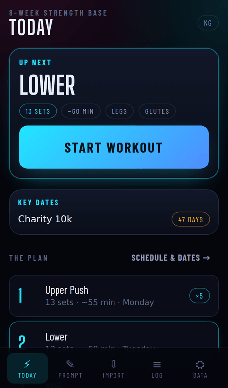
  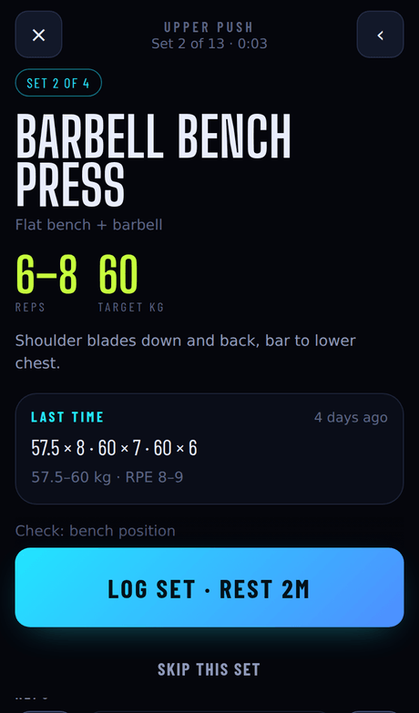
  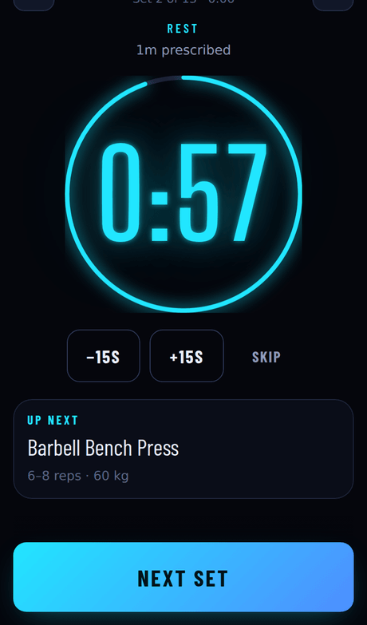
</p>

---

## What it is

Neon Sets doesn't write your training plan and has no AI of its own. You already
have a tool that writes good plans — this app makes one usable in the gym.

It builds a prompt from your answers, ingests the JSON that comes back, and turns
it into a workout you can follow one screen at a time with your hands full. It
installs to your home screen, works offline, and keeps everything on the device.

## How it works

| 1. Describe your training | 2. Paste the reply | 3. Train |
|---|---|---|
| 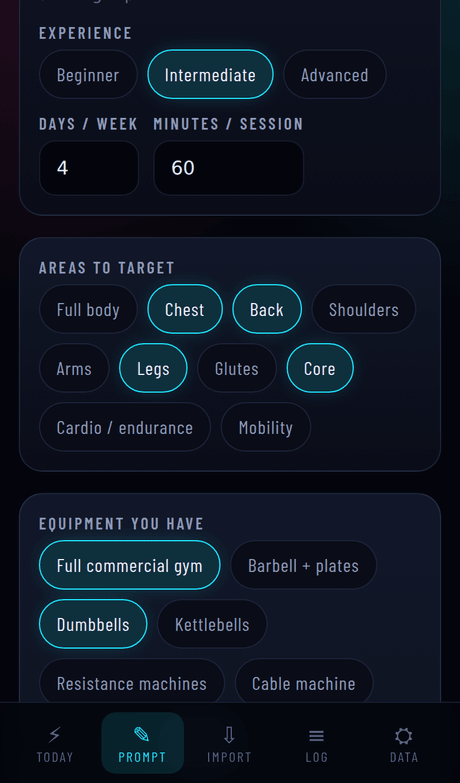 | 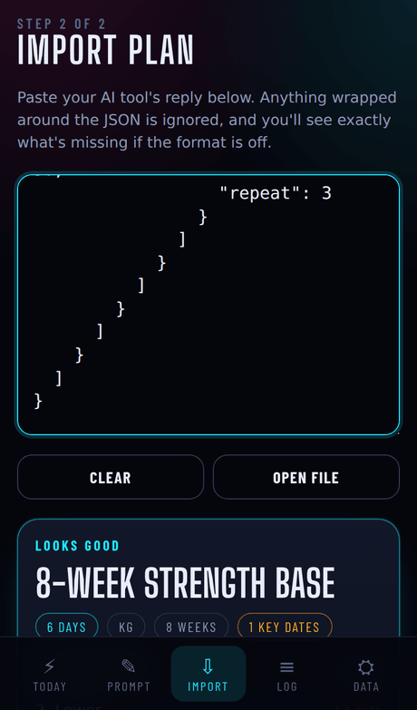 | 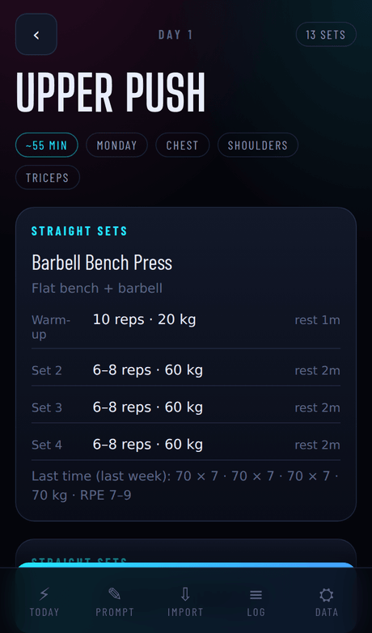 |
| Goal, days per week, session length, equipment, injuries, key dates. Tap **Copy prompt**. | Paste it into ChatGPT, Claude, Gemini — whatever you use — then paste the whole reply back. | Every set on its own screen, with the timer and the logging controls where your thumb is. |

## Using it

### Install it to your home screen

The app is designed to run full screen in portrait, not in a browser tab.

- **iPhone:** open the site in Safari → Share → **Add to Home Screen**.
- **Android:** open it in Chrome → ⋮ menu → **Install app**.

Installed, it runs offline, keeps the screen awake while you train, and your data
is far less likely to be cleared by the browser.

### Build your prompt

The **Prompt** tab asks what an AI would need to write you a decent plan: your
goal, experience, how many days a week, how long a session, which areas to
target, what equipment you actually have, injuries to work around, what you like
and hate, and any dates you're training towards. Toggles control whether it uses
supersets, drop sets and warm-up sets.

**Copy prompt** puts your answers *and* the exact JSON format the app reads onto
your clipboard. Nothing is sent anywhere — you paste it into your own AI tool.

### Import the plan

Paste the whole reply into the **Import** tab. Anything wrapped around the JSON —
"Sure, here's your plan!", a markdown code fence — is stripped automatically.

If the format is off you get specific errors with the path to each problem
(`days[0].blocks is missing — it must be an array`) rather than a shrug, plus a
**Copy a fix request** button that sends the exact errors back to your AI tool so
it repairs the plan instead of regenerating it.

If a plan is too long for your AI to produce in one go, ask for a few days at a
time: each reply imports as a complete plan, and the import screen offers to
**add its days to the plan you already have**.

### Run a workout

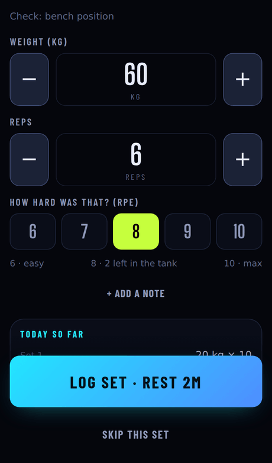

Tap **Start workout** and the app walks the day in order — straight sets first to
last, supersets and circuits interleaved round by round.

Each set screen shows the exercise in large type, the target reps and load, any
technique cues, the machine settings worth checking, and **what you did last
time**, including the range if the weight moved.

Log what you actually did with oversized controls: hold **+** or **−** to run the
number up, or **tap the number and type it**. Weight, reps, incline, level,
speed, distance and duration appear depending on the exercise. Rate the set 6–10
for perceived exertion, and add a note if something felt off.

Drop sets show each drop's load calculated from the weight you just entered.
Timed work gets its own full-screen countdown that fills in the duration for you.

<br clear="right">

### Rest between sets

Logging a set starts the prescribed rest automatically: a full-screen countdown
with the next exercise underneath, ±15s buttons, and three pips before zero. Time
comes from the clock rather than a tick loop, so locking your phone mid-rest
can't make the timer drift — and it keeps counting *past* zero into overtime
instead of silently ending your rest.

### See the trend

| Progress | Schedule |
|---|---|
| 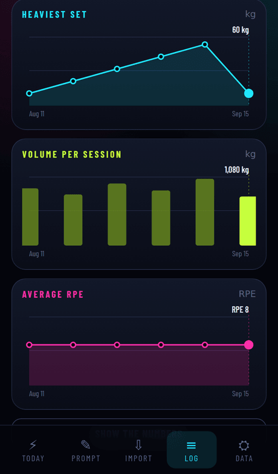 | 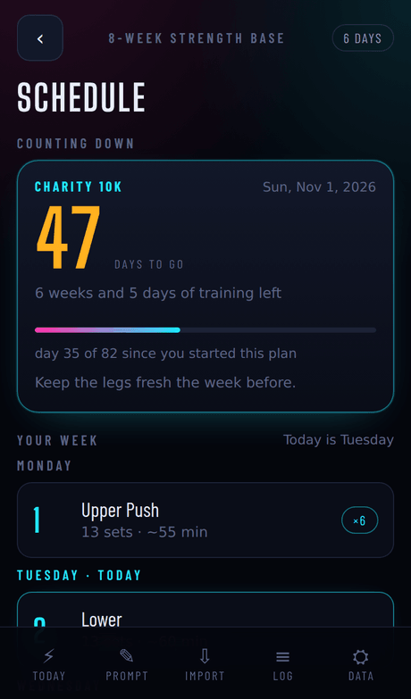 |
| Pick an exercise for heaviest set, volume, reps, time and average RPE across sessions. Drag any chart and a shared crosshair moves across all of them. Warm-ups excluded. | Your week laid out by weekday with rest days and today marked, and every key date counting down with progress through the plan. |

### Keep your data

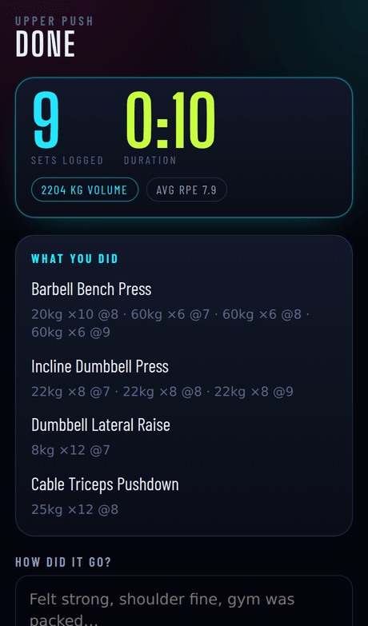

Finishing a session gives you the totals, what you did per exercise, and a
freeform box to note how it went. Forgot at the time, or thought of something
later? Open the workout in the **Log** tab and add or edit the note there — set
notes you typed during the session show up under each set alongside it.

The **Data** tab exports every plan and every logged set as a JSON file, and nags
you when you're overdue. **Copy progress for my AI tool** produces a plain-text
digest — what you lifted, for how many reps, at what RPE — wrapped in a prompt
asking for an updated plan, so your next block is built on real numbers instead
of guesses.

<br clear="right">

## Your data

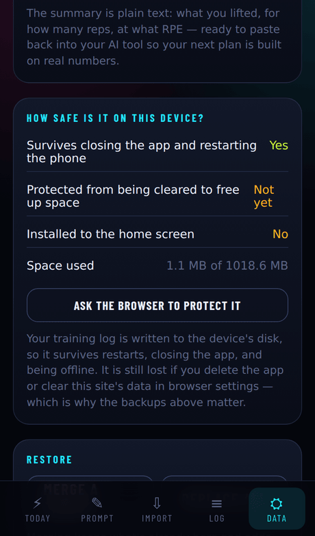

Everything is stored on the device and nothing is ever uploaded. There is no
account, no server, and no analytics.

**It survives restarting your phone.** The training log is written to the
device's disk, not to memory, so it survives closing the app, restarting the
phone, and being offline. The Data tab shows you its actual state: whether the
browser has been asked to protect it, whether you've installed to the home
screen, and how much space it uses.

What can still lose it:

| Risk | What happens |
|---|---|
| Deleting the app / clearing site data | Gone. This is the one to watch. |
| iOS's 7-day storage cap | **Does not apply** to apps added to the home screen — only to sites left in a browser tab. ([WebKit](https://webkit.org/blog/10218/full-third-party-cookie-blocking-and-more/)) |
| Phone running out of space | The app asks the browser for persistent storage, which Safari 17+ and Chrome grant largely on the basis that you installed it. ([WebKit](https://webkit.org/blog/14403/updates-to-storage-policy/)) |
| Losing the phone | Only your last export survives. Download backups. |

<br clear="right">

### Updates never overwrite what you've logged

Saved data lives under one key (`neon-sets:v1`) that app updates don't rewrite,
and four rules keep it that way:

- **Unknown fields are carried through.** Migration spreads whatever it finds
  before normalising the fields it knows, so data written by a newer build — or
  one you later roll back from — is preserved rather than stripped.
- **Nothing is deleted on read.** Data that can't be parsed is moved aside under
  its own key and reported in the Data tab with a download button. The app never
  silently replaces it with an empty store.
- **Destructive actions snapshot first.** Restoring a backup or deleting
  everything keeps a copy; **Undo the last restore** puts it back.
- **Loading never writes.**

`npm run test:data` checks all of it against the real persistence layer, on every
push.

## The plan format

The contract between your AI tool and the app is a single JSON object, described
in full in [`src/lib/schema.ts`](src/lib/schema.ts) (the `SCHEMA_SPEC` constant is
what gets copied into your prompt) and typed in [`src/types.ts`](src/types.ts).
[`scripts/sample-plan.json`](scripts/sample-plan.json) is a complete working
example.

```jsonc
{
  "schemaVersion": 1,
  "planName": "8-Week Strength Base",
  "units": "kg",
  "defaults": { "restSeconds": 90, "modality": "weights", "trackingFields": ["weight", "reps"] },
  "exercises": {
    "bench": { "name": "Barbell Bench Press", "equipment": "Flat bench + barbell" }
  },
  "events": [{ "name": "Charity 10k", "date": "2026-11-01" }],
  "days": [
    {
      "dayNumber": 1, "name": "Upper Push", "weekday": "Monday", "type": "strength",
      "blocks": [
        {
          "kind": "single",
          "exercises": [
            { "ref": "bench", "sets": [
              { "type": "warmup", "reps": 10, "targetWeight": 20, "restSeconds": 60 },
              { "repRange": [6, 8], "targetWeight": 60, "rpeTarget": 8, "repeat": 3 }
            ] }
          ]
        }
      ]
    }
  ]
}
```

It covers straight sets, supersets and circuits, drop sets, warm-ups, AMRAPs,
timed and distance work, machine settings, rest days, and key dates. Rest is
always a number of seconds; rest days are `"type": "rest"` with `"blocks": []`.

### Keeping the AI's output short

Long output is slow and it's where models drop details. The format has four ways
to say the same plan in less, all expanded on import, so the runner only ever
sees fully written-out plans:

| Short form | Instead of |
|---|---|
| `"repeat": 3` on a set | three identical set objects |
| `"defaults": { "restSeconds": 90, … }` | repeating rest, modality and tracking on every set |
| `"exercises": { "bench": {…} }` + `{ "ref": "bench" }` | re-describing equipment, cues and settings on every day |
| omitting every `"id"` | ids the app generates anyway |

On a representative plan — 5 days, 5 exercises each, 100 sets — that's **15,132
characters down to 7,104, a 53% reduction**, expanding to an identical plan.
Both forms import; the prompt asks for the short one.
`npm run test:format` asserts both the equivalence and the saving.

## Development

```bash
npm install
npm run dev          # http://localhost:5173/Workouts/
npm run build        # typecheck + production bundle into dist/
npm run preview      # serve the built bundle
npm run test:data    # saved data survives an app update
npm run test:format  # the short plan form expands to the same plan, and is smaller
npm run icons        # regenerate the app icons
```

Both checks run in CI on every push and before every deploy.

Stack: Vite + React + TypeScript, `vite-plugin-pwa` for the service worker and
manifest. No UI framework, no state library, no charting library, and no runtime
dependency beyond React. Fonts (Barlow Condensed, Big Shoulders Display — SIL
OFL) are vendored in `public/fonts` so the app works fully offline.

Screenshots in this README are generated from a real build by
[`scripts/screenshots.mjs`](scripts/screenshots.mjs).

### Deploying

Pushing to `main` builds and publishes to GitHub Pages via
[`.github/workflows/deploy.yml`](.github/workflows/deploy.yml). Enable it once
under **Settings → Pages → Source → GitHub Actions**; the site then lives at
`https://<user>.github.io/<repo>/`.

The base path comes from the repo name at build time. For a custom domain or
root-level hosting, build with `BASE_PATH=/`.

## Layout

```
src/
  lib/
    schema.ts     prompt text + the JSON spec sent to the AI tool
    validate.ts   tolerant parser; expands the short form
    steps.ts      flattens a day into the sequence the runner walks through
    storage.ts    load, migrate and protect what is saved on the device
    store.tsx     app state on top of storage.ts
    history.ts    "last time" recall, backup nagging, AI progress summaries
    progress.ts   per-exercise series for the charts
  screens/        Home, PromptBuilder, ImportPlan, DayPreview, Runner, Progress, Schedule, Data
  components/     timer, set logger, charts, shared controls
```
